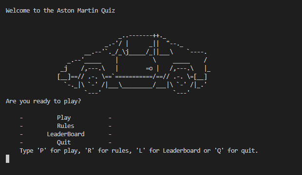
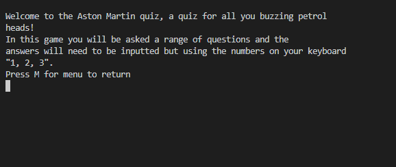
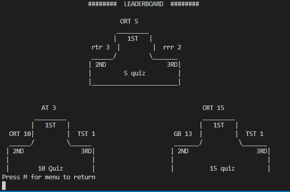
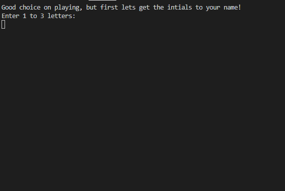
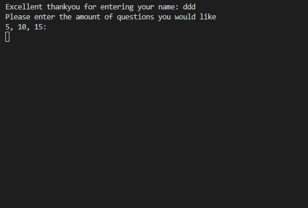
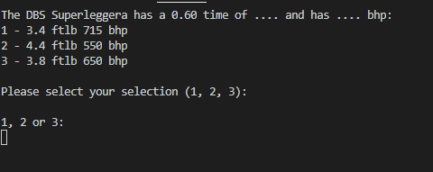
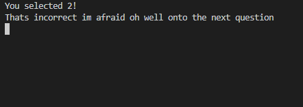

# Aston Martin Quiz
## Introduction
The Aston Martin quiz is a browser built quiz with Python. It is a simple multiple choice based on the prestigious vehicle brand Aston Martin, highlighting the vehicles specs, comforts and interesting facts.
As the game was developed in Python for use in the terminal, it utilises the Code Institute Python Template to generate a "terminal" onto the page, making it available within a web browser.

View the live website on [Heroku](https://aston-martin-quiz.herokuapp.com) Please note: To open any links in this document in a new browser tab, please press cntrl + Click.

## UX
### The Strategy Plane
* Aston Martin is intended to be a fun knowledge based quiz that people can take and will be ranked in a spreadsheet with other players, suitable for individual users looking to play a game for short or medium periods of time. Given the limitations of the terminal-based interface, care will need to be taken to incorporate some form of a visual stimulus.

#### Site Goals
* To provide users with a fun and simple to play quiz.
* To provide users with alternative options to choose a different amount of questions.
* To provide users with the ability to open a spreadsheet and see there ranking in comparison of other players

#### User Stories
* As a user I want an online quiz about a luxury car brandw
* As a user I want to be able to control the amount of questions that will be asked.
As a user I want to be able to compare my results with other players of the games.

#### The Scope Plane

**Features planned:**
* As there are certain restrictions in the scope of the development of the application, such as the terminal confines and methods of deployment. It will be important to ensure all functionality is contained within the game terminal screen.
* Despite the confines of the terminal window, the site should be visually stimulating with a graphic/image behind it and clear to the user that it is a quiz.
* Three question amount options should be available to the user	5 – 10 - 15.

### The Structure Plane
User Story:
> As a user, I want a fun and simple quiz to test my knowledge

Acceptance Criteria:
* It should be clear to the user that this is a quiz, what the quiz is about and how to play it with a option to read rules.
Implementation:
* The layout, use of askiart helps in order to create a fun user themed quiz. I also have used a background image to enable to user to feel in a luxurey quiz like the brand itself i have also added along the project validation for each user input.

User Story:
 > As a user, I want to be able to check my points and how many I have got in comparison to other players.
Acceptance Criteria:
* The user should have the option to check back on previous records and see there ranking
Implementation:
* The user will have the ability to read through in a seperate excel sheet all of the players along with there points achieved

### The Skeleton Plane
#### Wireframe mock-ups
Given that the application will be run within a terminal emulator which was provided within the CI template, there are limited options available in regards to how the program is displayed. Early on within the development of the theme of the quiz it made sense to have a luxury feel photo to to the luxury brand this then fitted in with the project and contents in the quiz to further the UI more pleasing to the user, I located a suitable background image on iStock. To position the terminal appropriately for the background graphic, and keeping user experience in mind, I decided to centre the terminal horizontally on the screen.  

### Logic Flow
To develop the logical steps required within the quiz, along with understanding how the different functions within the quiz logic elements would interact, I created a flow chart detailing the individual steps for the game. The full image can be viewed here Logic Flow Diagram
The game logic can be broken down into main sections. The initial startup runs and produces the askii art it then runs a game loop which calls functions to loop generate and validate different information, from username, points, creating question selection for the user.

### Game Loop
 
The player will input what they would like to play a 5,10,15 quiz this will then establish the amount of questions produced from Aston martin
I will utilise a variety of return methods into a game loop in order to be able to pull and pass specific user data into other functions, therefore I will not have to pass information from loop to loop to loop.

### The Surface Plane
#### Design
Once I had decided on the theme of the quiz itself ie Aston Martin due to my mechanical background, I therefore knew the colour scheme and silhouette image I wanted as my background.

### Features
#### Welcome Screen
At the start of game the user is greeted with a menu which consists of a Quit option, Leaderboard option, Rules and Play option users are told what they are required to input for them to access a menu.

#### Instructions Screen
If users select the instructions option from the main menu the screen will display an overview of te game and how to play. Aswell as the option to return to the main menu.

#### Leaderboard Screen
If the user selects the leaderboard option it prints a leaderboard to the screen and shows 1,2,3 for the 5, 10 and 15 game option and it gets the highest users points along with the key to that value to ensure its a live leaderboard

#### Play option
When selecting the play option the game then starts the game loop which then does the below.

#### Name Option
The option is then given to the user to put in two alphabetic characters there intitials this is so it can show there name in the leaderboard with there point achieved in the excel sheet.

#### Question amount selection
When the user confirms that they would like to play the game, they are greeted by a message asking them  hjow many questions in the game would they like to play.

Once the name has been inputted the game loop comences and start to generate the questions from a seperate file. The questions are then displayed along witht the potential answers and the option to input a 1,2,3 this is then up to the user to input there choice.

 

This then calls for the function to pass in the actual correct answer in comparison to the users guess. Depending on if it is correct depends on what the code does next. 
If the answer inputted by the user is the correct answer it adds a point to the users score and gives a well done message witht the current users point value.

If the answer inputted by the user is wrong it gives the user a message of that incorrect onto the next question.

After the game is finished it adds the users initials and there score to the excelsheet. Thi is how the leaderboard gets all of the players initials and there points and works out accordingly a 1st, 2nd, 3rd

### Future Enhancements
In the future I would add more questions to the questions file as although it generates the questions randomly there are only 30 questions currently.

### Testing
### Testing Strategy
I took a two-stage approach to testing the application. The first stage was continuous testing as the application was being developed. With the application being based within the terminal, it was straight forward to test functions and print statements as they were being developed using the terminal within the IDE I was also able to check validation easily for any user inputs to ensure only text could be put in nothing else when required and only the correct input could be inputted when asked 5, 10, 15

### Second stage testing
#### For the second stage of testing my project, I utilised a more formal structured approach and created a test schedule for the application which covered each logical cycle. I then proceeded to run through the manual tests that i had made and made sure to note any errors that I found. Where the code didnt do as expected, the code was altered to correct the behaviour almost straight away unless it was a major issue which I documented via the Github issues section. After extensive testing the only issues. I found was the odd validation error that the user could input a symbol instead of there intitials. Once the code was adjusted accordingl the code past the validation.

The individual python files were also validated using pep8online.com further details are below.

### Testing Overview
Testing was divided into different sections to ensure everything was tested individually with test cases developed for each area.
 
### A full detailed breakdown of the testing procedures and methodology can be found in the [Testing.md](TESTING.md) file here
### Validator Testing
#### pep8online.com - I utilised pep8online.com to validate my python code. All python files were checked with no errors reported.
#### The following files however did include warnings regarding a line break before binary operator
#### board.py - 2 warnings
#### comp.py - 1 warning
#### game.py - 27 warnings
#### player.py - 2 warnings
#### setup.py - 4 warnings

### The warning suggests that there should not be a line break before a binary operator, however on checking with the python pep 8 guidelines it states that the line break should be before the binary operator. The point in the PEP8 guidelines can be found here. As the guidelines may have been updated more recently than the validator, the warning message regarding the binary operators was ignored.
#### Screenshots of the validator reports are here:
o   blank.py file
o   board.py file
o   boat.py file
o   comp.py file
o   editscreen.py file
o   game.py file top
o   player.py file
o   run.py file
o   setup.py file
o   start.py file

### Notable Bugs

#### December 4th, 2021.
I started an issue on Github that I wasn’t able to sort on the spot on my main menus validation. Which I update when I was able to assess the issue and identify the code required fixing this. The update in the issue shows also my correction and what I did to resolve the issue.

----------------

#### December 7th, 2021.
I discovered a new bug that was a hidden issue that I hadn’t thought about correctly. This was for the main game loop. Randomly it would not generate a question.... this therefore was an issue. Due to the game generating questions randomly anyway it was hard to find out at what question in the questions file was throwing it off. Upon reflect it should have been a simple spot. The reasoning behind this was because the code was getting 3 answers as well on the next line. Then printed the question and the 3 possible answers. It was unable to get 3 possible answers for any of the random questions that were only holding 2 possible answers (“true/false”).

----------------------

#### December 13th, 2021.
I recieved an email during my final stages of code testing saying my API had been suspended. i believed this to be due to a over use of refreshes and updates to the
file in a short space of time when under testing. This therefore stopped my code running at all.

--------------

December 7th, 2021.
I discovered a new bug that was a hidden issue that I hadn’t thought about correctly. This was for the main game loop. Randomly it would not generate a question.... this therefore was an issue. Due to the game generating questions randomly anyway it was hard to find out at what question in the questions file was throwing it off. Upon reflect it should have been a simple spot. The reasoning behind this was because the code was getting 3 answers as well on the next line. Then printed the question and the 3 possible answers. It was unable to get 3 possible answers for any of the random questions that were only holding 2 possible answers (“true/false”).

----------------------

### Libraries Utilised

#### Built in Python Libraries
Several of the built in python libraries were utilised to enable additional functionality within the application math.
The math library was imported to utilise the math.floor functionality. This was used during the calculation of the correct number of questions along with math.random in order to generate the random number to make sure that users didnt get the exact same questions. 

#### Time
The time library was also imported to utilise the time.sleep functionality. This enabled me to incorporate specific time delays within the program which adds to the player experience by simulating the time between the player answering there points going up or there correct/wrong message before the next question is displayed.

#### os
The os library was imported to utilise the os.system and os.name functionality. This enabled me to add functionality to the terminal emulator which allowed me to clear the previous print statements. This provides a clearer and more structured experience for the user.

#### GSpread
I also added in the GSpread function which allowed me to link the API for google sheets into the file so I could sucessfully create a live leaderboard that would change on every players input.

#### Deployment
The site was deployed via Heroku, and the live link can be found here - [Aston Martin Quiz]()
The project was developed utilising a Code Institute provided template. During the development of the project the template was updated to increase functionality. I switched over to the new template mid project which you can see within the commit history. Some of the deployment steps below are specifically required for the new CI template and may not be applicable to older versions, or different projects.
Project Deployment
To deploy the project through Heroku I followed these steps:
* Sign up / Log in to Heroku
* From the main Heroku Dashboard page select 'New' and then 'Create New App'
* Give the project a name - I entered Calcio-Jack and select a suitable region, then select create app. The name for the app must be unique.
* This will create the app within Heroku and bring you to the deploy tab. From the submenu at the top, navigate to the settings tab.
* This next step is required for creating the app when using the CI Python Deployment Template. If you created your own program without using the CI Template, you might not need to add a config var.
* In the config vars section select the reveal config vars button. This will display the current config vars for the app, there should be nothing already there.
* In the KEY input field input PORT all in capitals, then in the VALUE field input 8000 and select the Add button to the right.
* Next select the add buildpack button below the config vars section.
* In the pop-up window select Python as your first build pack and select save changes.
* Then repeat the steps to add a node.js buildpack.
* The order of the buildpacks is important, in the list Python should be first with Node.js second. If they are not in this order, you can click and drag them to rearrange.
* Next navigate back to the deploy tab using the submenu at the top of the page.
* In the deployment method section select the GitHub - Connect to GitHub button and follow the steps prompted if any to connect your GitHub account
* In the Connect to GitHub section that appears, select the correct account, and enter the name of the repository and select search.
* Once Heroku has located the repo select connect.
* This will connect the repo to the app within Heroku. Below the Apps Connected to Heroku section will be the Automatic Deploys section.
* In this section, confirm the correct branch of the repo is selected in the drop-down box, and then click the Enable Automatic Deploys button
* This will ensure whenever you change something in the repo and push the changes to GitHub, Heroku will rebuild the app. If you prefer to do this manually you can utilise the manual deployment options further down. For this project I utilised the Automatic Deployment to enable me to check changes I made to the app as I developed it.
* Heroku will now build the app for you. Once it has completed the build process you will see a 'Your App Was Successfully Deployed' message and a link to the app to visit the live site.

### Credits
#### Code
I was informed of a method to clear the terminal by mentor Tim Nelson who had found the method in a Python cheat sheet provided by coding4you. Tim had suggested that i used the method successfully within my project to keep the window clearer to improve UX.

I also was helped to plan my logic of the code with another student Matt Bodden, who helped regarding the games loop.

### Content

#### Background Image
I as stated above already had an idea of how I was going to link the image behind the terminal along with what style of photo I wanted.

#### Stack Overflow
Stack overflow was useful a few times whilst I developed my understanding of filtering and sorting through data from an excel sheet that was appended into a dict.

### Acknowledgements
I'd like to thank the following:
•   My mentor Tim Nelson for encouraging me throughout the project and providing me with supporting and useful coding skills and knowledge.
•   Matt Boden for helping with the planning of the logic of how it is going to generate random numbers and pull associated questions aswell as answers.
•   CI Tutor support for helping in regards to sorting through the list of my excel sheet.

