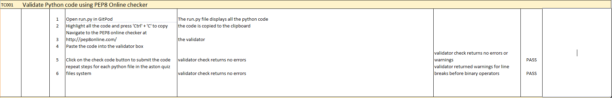

 # Test Cases and Execution Report
To navigate back to the main README click [here](README.md)

The full testing spreadsheet containing all the tests performed during the testing phase of development can be found here

### Testing
### Testing Strategy
I took a two-stage approach to testing the application. The first stage was continuous testing as the application was being developed. With the application being based within the terminal, it was straight forward to test functions and print statements as they were being developed using the terminal within the IDE I was also able to check validation easily for any user inputs to ensure only text could be put in nothing else when required and only the correct input could be inputted when asked 5, 10, 15

### Second stage testing
For the second stage of testing my project, I utilised a more formal structured approach and created a test schedule for the application which covered each logical cycle. I then proceeded to run through the manual tests that i had made and made sure to note any errors that I found. Where the code didnt do as expected, the code was altered to correct the behaviour almost straight away unless it was a major issue which I documented via the Github issues section. After extensive testing the only issues. I found was the odd validation error that the user could input a symbol instead of there intitials. Once the code was adjusted accordingl the code past the validation.

The individual python files were also validated using pep8online.com further details are below.

### Testing Overview
Testing was divided into different sections to ensure everything was tested individually with test cases developed for each area.
 
A full detailed breakdown of the testing procedures and methodology can be found in the [Testing.md](TESTING.md) file here
### Validator Testing
pep8online.com - I utilised pep8online.com to validate my python code. All python files were checked with no errors reported.
The following files however did include warnings regarding a line break before binary operator

#### Screenshots of the validator reports are here:

### Notable Bugs

#### December 4th, 2021
I started an issue on Github that I wasn’t able to sort on the spot on my main menus validation. Which I update when I was able to assess the issue and identify the code required fixing this. The update in the issue shows also my correction and what I did to resolve the issue.

#### December 7th, 2021.
I discovered a new bug that was a hidden issue that I hadn’t thought about correctly. This was for the main game loop. Randomly it would not generate a question.... this therefore was an issue. Due to the game generating questions randomly anyway it was hard to find out at what question in the questions file was throwing it off. Upon reflect it should have been a simple spot. The reasoning behind this was because the code was getting 3 answers as well on the next line. Then printed the question and the 3 possible answers. It was unable to get 3 possible answers for any of the random questions that were only holding 2 possible answers (“true/false”).

#### December 13th, 2021.
I recieved an email during my final stages of code testing saying my API had been suspended. i believed this to be due to a over use of refreshes and updates to the
file in a short space of time when under testing. This therefore stopped my code running at all.

Test 1

### Python Validation
The Python code was checked using the pep8 validator available at pep8online.com. Errors were reported for to longer lines i edited my code accordingly until there were no reported errors by the validator. The following file however did include warnings regarding a line break before binary operator this is acceptable due to some code needing to be on more than one line.

list of files with warnings
run.py - 4 warnings

The point in the PEP8 guidelines can be found [here](https://www.python.org/dev/peps/pep-0008/) 

Screenshots of the validator reports are here
[run.py Pass](images/pep8_runpy_pass.PNG)
[questions.py Pass](images/questions_pep8_pass.PNG)

Test 1
Start Menu Functionality
The start menu input was tested for the correct validation of the user input. On correct input the screen will redirect to the correct screen. On incorrect input the input validation correctly displays an error message to the user to provide guidance on how to move on.

[Test1](images/test_1.PNG)

Instruction Screen Functionality
Input validation was also tested on the instructions screen along with testing that the user could launch the game from the screen. On incorrect input the screen displays the correct error message with guidance on how to correctly input the required values. On correct input the desired functionality proceeded as designed.

Leaderboard Screen Functionality
Input validation was also tested on the leaderboard screen along with testing that the user could launch the game from the screen. On incorrect input the screen displays the correct error message with guidance on how to correctly input the required values. On correct input the desired functionality proceeded as designed.

[Test2](images/test_2.PNG)

User intials input functionality
Input validation was also tested on the user initials screen along with testing that the user could launch the game from the screen. On incorrect input the screen displays the correct error message with guidance on how to correctly input the required values. On correct input the desired functionality proceeded as designed.

[Test3](images/test_3.png)

User question input functionality
Input validation was also tested on the game play mode screen along with testing that the user could launch the game from the screen. On incorrect input the screen displays the correct error message with guidance on how to correctly input the required values. On correct input the desired functionality proceeded as designed.

[Test4](images/test_4.PNG)